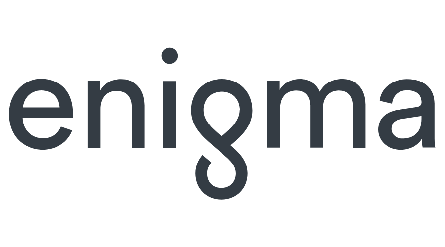

This repository provides a set of machine translation models under
pytorch lightning wrapping.

Plan:
- [ ] Write base pytorch-lightning pipeline
- [ ] Add 6 seq2seq models
- [ ] Rewrite torchtext dataset in a convenient manner 
- [ ] Add custom dataset (not torchtext)
- [ ] Add omegaconf support
  

- [ ] Write big transformer model with good quality
- [ ] Write chatbot or another api
- [ ] Make benchmarks
- [ ] Use knowledge distillation
- [ ] Add tutorials
- [ ] Make pretrain

- [ ] Try to extend to framework
- [ ] Add docker support
- [ ] Use Enigma for other DS tasks

## 1.0 Introduction

Enogma - is a deep learning machine translation project with
huge number of DL models inside it.

## 2.0 Usage examples
